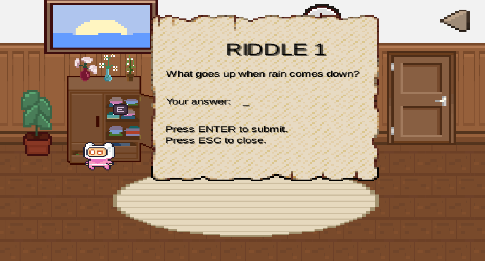
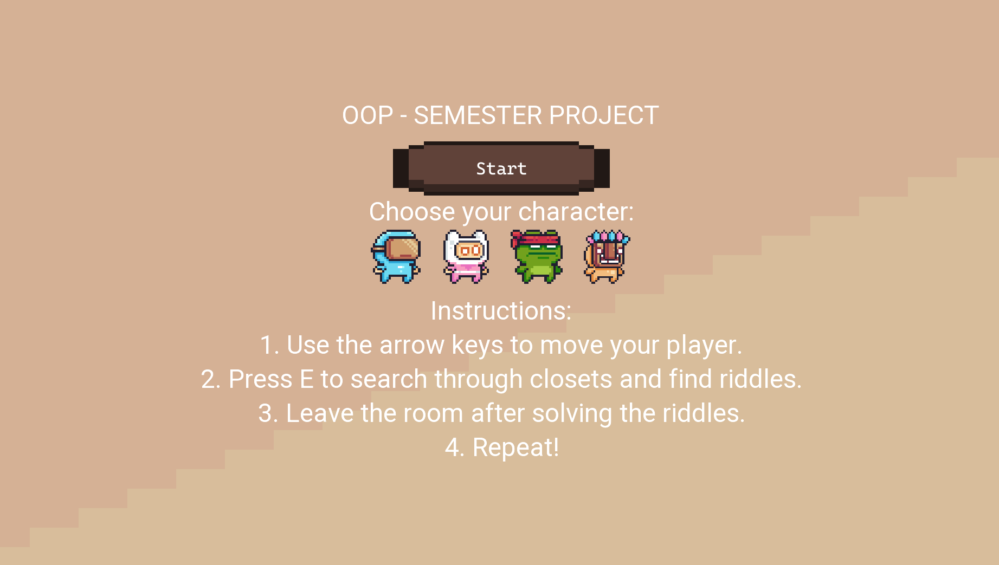

# Mystery Escape Game

## Overview

Mystery Escape Game is a Java-based text adventure where players must solve riddles to escape a locked room. The project was developed to strengthen object-oriented programming skills while creating an engaging puzzle-solving experience.

## Features

- Interactive UI
- 
- Multiple riddles

- Player choice

- Player input validation
- Room animations

- Modular object-oriented design

## Technologies Used

- Java
- Object-Oriented Programming
- libGDX
- Online assets for art

## What I Learned

- Class design
- Encapsulation
- Program flow
- User interaction

## Future Improvements

- Save game
- Multiple rooms
- Inventory system
- Difficulty levels
